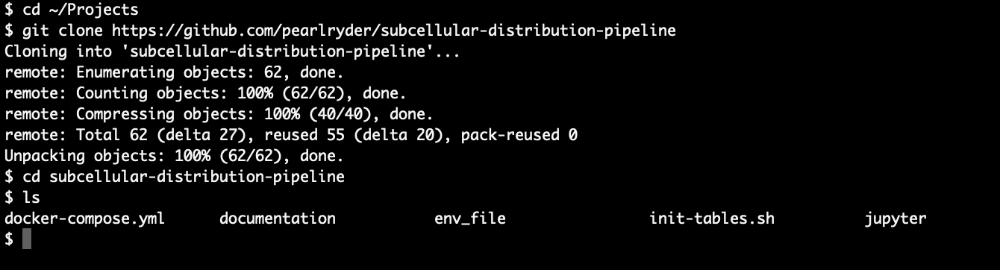
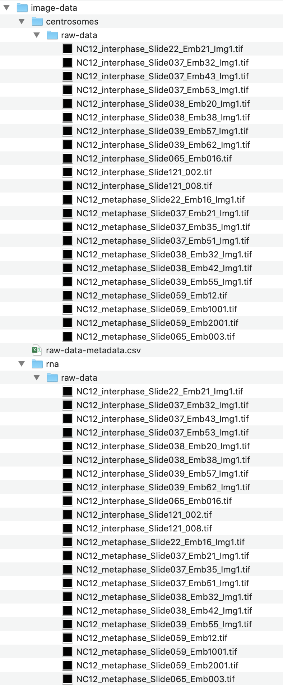
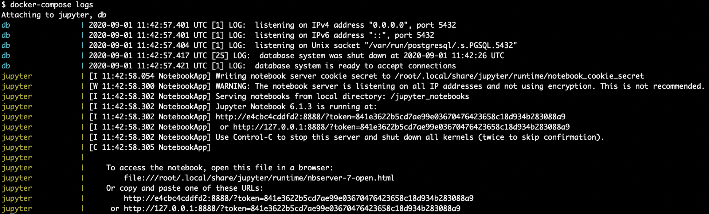
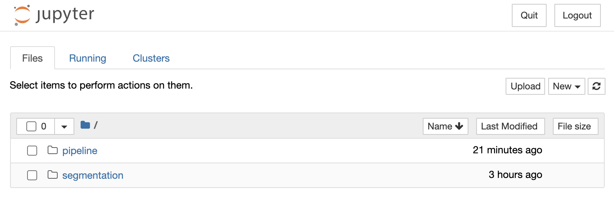

# Preview
Welcome to the SubcellularDistribution pipeline documentation! Please note: the bottom of this documentation file contains an Appendix with useful resources, including an introduction to image analysis, using the unix shell, and Docker commands. If you're unfamiliar with these concepts, you may want review the Appendix prior to starting.

# 1. Software installation
For Windows users, we recommend using Windows Powershell as your terminal program.

As a general note, when we refer to a "directory", you can think of that as a folder on your operating system.

## Step 1.1 Install the Fiji image viewer
We use [Fiji](https://fiji.sc/) to open and view z-stack .tif images. We recommend that you download and install Fiji prior to starting this workflow.

## Step 1.2: Install Docker for your system
The SubcellularDistribution pipeline is implemented using Docker in order to facilitate installation and reproducibility. Docker creates an isolated operating system on your computer that only it controls. These isolated environments are called containers. You can think of these containers as virtual machines that you connect to from your computer. We provide instructions for Docker to recreate this container system across multiple different platforms. Instructions are provided on the Docker website for [Mac](https://docs.docker.com/docker-for-mac/install/) and [Windows](https://docs.docker.com/docker-for-windows/install/).

Once you have installed Docker, you will need to start the application. For those on a Mac, we recommend adjusting the memory resources available to your Docker containers. This setting is available in the "Preferences" interface under "Resources". We recommend starting with 5 GB of memory available. You can also adjust the number of CPUs available in the same interface.

The Docker installation is a bit trickier on Windows. You will need to have  Windows Subsystem for Linux 2 (WSL 2) installed and an up-to-date installation of Windows. Here is a brief overview of the installation process on Windows 10:
1. Open an Administrator Powershell window by pressing the Windows button + X, then selecting Windows Powershell (Admin) from the menu
2. Check to see if you have WSL 2 installed by typing the following command and then looking for the version of the distribution (distro)
```bash
wsl --list --verbose
```
If WSL 2 is installed, you can proceed to download the installer [from Docker]((https://www.docker.com/get-started)). If not, you can install it using the following steps (see more at [the Microsoft documentation](https://docs.microsoft.com/en-us/windows/wsl/install-win10)).
3. To install WSL 2, first enable Windows Subsystem for Linux WSL 1 using the following command:
```bash
dism.exe /online /enable-feature /featurename:Microsoft-Windows-Subsystem-Linux /all /norestart
```
4. Enable the "Virtual Machine Platform" feature:
```bash
dism.exe /online /enable-feature /feawsl --set-default-version 2turename:VirtualMachinePlatform /all /norestart
```
5. Restart your computer.
6. Update to the Windows Subsystem for Linux 2 (WSL 2). Make sure that you're running the most up-to-date version of Windows available for your machine prior to trying this code. If you run into an error, you likely either need to update Windows or update your Linux kernel. See [this webpage](https://docs.microsoft.com/en-us/windows/wsl/install-win10) for more info.
```bash
wsl --set-default-version 2
```
7. Download and install the [Windows installer](https://www.docker.com/get-started)

## Step 1.3: Test git and install if necessary
You will use git to download the SubcellularDistribution pipeline code from GitHub. In order to test if you have git installed already, open up a Windows Powershell or Mac terminal window and type:

```bash
git --version
```

If you see an error message that you don't have git, follow the instructions to install it [here for Mac](https://www.atlassian.com/git/tutorials/install-git#mac-os-x) or [here for PC](https://www.atlassian.com/git/tutorials/install-git#windows).

## Step 1.4: Download the SubcellularDistribution pipeline from GitHub
First, you should create a folder to contain your projects. We recommend something like a Projects folder within your home directory. You can use the commands below to make a Projects folder and navigate to it using the terminal:

```bash
mkdir ~/Projects
cd ~/Projects
```

Note that if you on a Windows machine using Powershell, your filepaths will appear different than the filepaths we show (e.g. `C:\Users\username` instead of `/Users/username`). However, you should be able to use the commands we provide in Powershell and they'll be interpreted correctly. For simplicity, we will write commands in the following directions using the unix form.

Once you are in this directory, download the SubcellularDistribution pipeline code from GitHub using the command:

```bash
git clone https://github.com/pearlryder/subcellular-distribution-pipeline
```

Now you can navigate into this window using ```cd subcellular-distribution-pipeline```. You can test if the files have downloaded using ```ls```. You should see a printout to your terminal like this: .

## Step 1.5: Add data to the "image-data" folder
If you would like to test the code using our test dataset, the data is already included in SubcellularDistribution pipeline on Docker. If you need to access it for any reason, you can download it at [FigShare](https://figshare.com/projects/SubcellularDistribution_pipeline/86732). Sample output is available for you to compare your own results on the same website.

If you would like to analyze your own data, you will need to organize it as follows.

The SubcellularDistribution pipeline works on single channel .tif files that represent subcellular structures from the same multichannel microscopy image. For example, you may have captured an image that has three channels: nuclei, centrosomes, and RNA. You should split this image into its component single channel .tif files. These .tif files should be added to separate "raw-data" folders inside of a folder named for each subcellular structure. The different channels from one original image should all have the same name so that the pipeline can find the structures from the same image.

Open the "jupyter" folder and then the "image-data" folder. Create empty folders inside the image-data folder named for the structures that you want to analyze. Within these folders, add a "raw-data" folder holding single channel .tif files for that structure. In general, avoid naming structures with upper-case letters, numbers, or special characters - these don't play well with the database that you'll use later. When you're done, the folder structure in your image-data folder should look like this (although the names of the structures will be different): .

If you intend to use the provided Allen Institute Cell Segmenter method for 3D segmentation, then you are done (for those trying out the pipeline with our data, we do provide optimized segmentation workflows) However, you have an option to provide 3D segmentations that you have generated using another program. In that case, simply add a "segmentations" folder within each "structure" folder and add the .tif files for your 3D segmentations. They should all have the same name as the corresponding raw-data image.

## Step 1.6 Create a metadata file for your images
**If you are analyzing our test dataset, then you can skip this step.**
Your imaging experiment likely contains images of a control biological condition together with images from your experimental condition. You may also have multiple biological replicates or images from different biological conditions, such as developmental stages. You can use the database to help track where each image comes from -- is it an image of control condition or an experimental condition?

You should store these data in a .csv file. We provide an example .csv file `raw-data-metadata.csv` with our sample dataset. You can create this file for your own experiment using Excel and then "Save As" .csv (you specifically want the "Comma Separated Values" file type and not the "CSV UTF-8" file type). The first row of your .csv file should contain labels that will become column names when you upload this data to postgres.

Add this raw-data-metadata.csv file to the image-data folder.

## Step 1.7: Start the SubcellularDistribution pipeline using docker-compose

Once again, open a terminal window. Navigate to the subcellular-distribution-pipeline folder that you created in Step 1.3 (`cd ~/Projects/subcellular-distribution-pipeline`). Ensure that you're in the expected folder using the command ```pwd``` (print working directory). Next, you can initialize the SubcellularDistribution pipeline app using the command:

```bash
docker-compose up -d
docker-compose logs
```

When you run the docker-compose logs command, you will see a printout to your terminal that contains logs for the container running the Jupyter notebooks. This will include a website that you can copy-paste into your browser in order to access the Jupyter notebooks in your computer. For example, the link is the last line in this image: .

Copy-paste that link into a browser window, which will bring up the Jupyter notebook interface: 

**Using Jupyter notebooks**: If you have never used Jupyter notebooks before, we recommend opening one of the notebooks (.ipynb files) in either the "pipeline" or "segmentation" folder, then selecting the User Interface tour from the Help menu to get oriented. When you're done with the notebook, select "File" > "Close and Halt". In general, each "cell" of a notebook contains either Python code (light gray background) or explanatory text (white background). You can run a cell using the "Run" button. The notebook is interactive, and will often print out a response or show an image / plot just below each cell. Other times the cell will run and you'll see the brackets to the top left corner of the notebook update with a number to show you the order in which cells have be executed.

You're now ready to start processing data using the SubcellularDistribution pipeline! Whenever you are done working with the pipeline, you can shut down the Docker system using:

```bash
docker-compose down
```

# 2. Segment images

## Step 2.1 Copy data to Docker
**If you are analyzing our test dataset, then you can skip this step.**
The first step for this pipeline is to copy your images onto the Docker container where you will run the SubcellularDistribution pipeline code. In order to do this, first navigate to the image-data/ folder that you added your data to in Steps 1.5 and 1.6.

```bash
cd ~/Projects/subcellular-distribution-pipeline/jupyter/image-data/
```

Then, get the filepath for this folder using the `pwd` command:
```bash
pwd
```

Copy-paste this filepath to replace the `/Users/username/Projects/subcellular-distribution-pipeline/jupyter/image-data` path below:

```bash
docker cp /Users/username/Projects/subcellular-distribution-pipeline/jupyter/image-data/. jupyter:/data/
```
Running this command will copy any data in the image-data/ folder to your Docker container that runs the code. In order to check if the copy command worked as expected, you interactively interact with the Docker container using the terminal with the following commands. Don't copy the # sign or anything after it - those are just comments to help explain what each command does:

```bash
docker exec -it jupyter bash  # open an interactive shell with the Jupyter container running on Docker
pwd # print working directory
cd ../data/  # change the working directory to the /data/ folder
ls # list the contents of the current working directory
exit # exit out of the interactive shell
```

When you run the `ls` command above, you should see the data that you copied from your computer in the Docker container. You will also see the test data that is included in the pipeline app, in the folders "centrosomes" and "rna".

## Step 2.2 Segment images using the Allen Institute Cell Segmenter
The first step for this pipeline is to create 3D segmentations of your data. We provide instructions below for using the Allen Institute Cell Segmenter to segment your images. If you have a preferred segmentation method, you can also segment your images outside of the pipeline and add them to a "segmentations" folder inside each "structure" folder in the image-data folder.

We **highly recommend** watching the Allen Cell Segmenter team's [video tutorial](https://www.allencell.org/segmenter.html) to learn more about the workflow. You can also read about executing Jupyter notebooks [here](https://jupyter-notebook-beginner-guide.readthedocs.io/en/latest/execute.html#executing-a-notebook). To understand the basics of the image segmentation process, we recommend [this video series](https://www.ibiology.org/techniques/bioimage-analysis/#part-1).

In general, the approach of this segmentation workflow is to first figure out good parameters for segmentation using interactive "playground" notebooks. Once you've found a segmentation workflow that you're happy with, you can then use the "batch-segmentation" notebooks to process all of the images in your dataset.

For the purpose of this documentation, we'll walk through the process of segmenting the "rna" smFISH signals. The process is the same for segmenting the centrosome data in our test dataset, you'll just need to use the corresponding Jupyter notebooks. If you have a different structure, you can use the [lookup table](https://www.allencell.org/segmenter.html) provided by the Allen Institute to determine the best playground notebook to use as a starting point for your segmentation. We have provided these playground lookup notebooks in the "all_structure_playgrounds" folder inside of the segmentation folder.

In your browser with the Jupyter notebook interface, click on the "segmentation" folder. Then click on the playground_rna.ipynb Jupyter notebook to open it. Use the "Run" button to advance through each cell of the Jupyter notebook. These notebooks are interactive and allow you to visualize how each step of the workflow contributes to the final segmentation. We encourage you to adjust parameters and see how the output changes. For example, if the gaussian smoothing sigma starts at 1, try 0.1 and 5 to see how these changes affect the smoothing process. You can save final segmentations using the final cell. This code will save test segmentation files to an output folder in the home directory of the jupyter container.

Downloading images is useful, because we've found we can better assess the quality of segmentation when inspecting the original data and segmented image in [Fiji](https://fiji.sc/). In order to move data from your Docker container out to your home machine where you can open the image, you can use the Docker cp command. The command below copies data from the jupyter container's output folder to an output folder:

```bash
docker cp jupyter:/output/ ~/Projects/subcellular-distribution-pipeline/output/
```

You can open the original image and a segmentation file in [Fiji](https://fiji.sc/) and then use the Sync Windows function to directly compare the images. For your signals, you want to assess the following questions:
* Are objects of interest included in the segmentation?
* Is the background appropriately excluded?
* Are objects of different sizes appropriately segmented?

Note that no segmentation process will ever be perfect. We refer you to this [excellent article](https://blog.cellprofiler.org/2019/10/21/when-to-say-good-enough/) by Beth Cimini, a senior computational biologist in the Imaging Platform led by Anne Carpenter at the Broad Institute, for a philosophical discussion of when to call a workflow "good enough." Remember, you want to robustly quantify the difference between two biological states as accurately as feasible, while recognizing that discovering the "universal truth" of your biological process is impossible.

Continue this process until you're satisfied with the segmentation process. We recommend walking through at least two images from each biological condition to test your workflow before moving to the next step - batch processing.

## Step 2.3 Batch process image segmentation
Once we're satisfied with the segmentation workflow, we use Jupyter notebooks to execute batch processing on all of the images for a given structure. We encourage you to then review the results of that segmentation for each image in Fiji (or a representative subset of your images if your dataset is really big).

If you changed the parameters in the Jupyter notebook for RNA segmentation, then you'll first want to update the batch processing function in the "batch-rna-segmentation.ipynb" notebook. Update the code using copy-paste so that the pre-processing, processing, and post-processing steps reflect the workflow you optimized in step 2.2.

Once you've updated your batch-rna-segmentation.ipynb code, execute each cell in the notebook using the Run button. You'll see a status message printed as each image segmentation is started. This notebook will save these images to a "segmentations" folder inside of the "image-data" folder. You can use the following Docker cp command to move the segmentation files outside of Docker, in order to inspect them against your data:

```bash
docker cp jupyter:/data/rna/segmentations ~/Projects/subcellular-distribution-pipeline/rna/
```

Once you're satisfied with the segmentations for your smFISH signal, you'll want to repeat the same process for your other structures of interest. If you're using our test image-data to learn the workflow, you can repeat the steps above using the playground_centrosomes.ipynb and batch-centrosome-segmentation Jupyter notebooks.

If you have other structures of interest, you can use the Allen Cell Segmenter [lookup table](https://www.allencell.org/segmenter.html) to identify a starting point for your segmentation workflow. We've provided the Allen Cell Segmenter playgrounds in the "all_structure_playgrounds" folder. Once you've optimized the workflow, you can duplicate the "batch-template-segmentation.ipynb" notebook and then copy-paste your segmentation workflow into that notebook. This process should allow you to segment most subcellular structures of interest.

# 3. Process data using the SubcellularDistribution pipeline
Once you're satisfied with the segmentation process and you've run the batch processing notebooks, you're ready to process the data using the SubcellularDistribution pipeline. Navigate to the "pipeline" folder (look for a small blue folder icon to click on the top left of the gray toolbar on the Jupyter notebook interface). Now open the pipeline.ipynb notebook.

## Step 3.1 Update parameters in cell 1
The first step for this pipeline is to update your parameters. You can choose a name for your database.

Next, you can update the path to the raw data and segmented images, if you've changed those (we recommend sticking to our defaults). You can also update the names of the folders that contain raw-data and segmented images.

You'll need to change the list of structures to match your experiment. For example, if you have an experiment with nuclei, myosin, and lysosomes, you would update the structures variable to:

```bash
structures = ['nuclei', 'myosin', 'lysosomes']
```

The pipeline will assume that the images for these structures are inside of folders named 'nuclei', 'myosin', and  'lysosomes', respectively.

The pipeline can accommodate if your segmentation files have a different suffix than your raw data files. Update the segmentation_file_suffix variable accordingly. If your segmentation files have the same name as the raw data, then change this variable to an empty string (''). You won't need to change this variable if you've used our batch processing notebooks.

Finally, update the scale parameters for your pipeline. The pipeline uses these scales to convert from pixels to microns for the distance measurements. Note that the "z_scale" is the your step size in the z dimension.

## Step 3.2 Create a postgres database for your experiment
The next code cell will create a database for your experiment, using the name you defined in the previous cell. You will only need to run this cell once. If you re-run the cell, the database will not be overwritten.

## Step 3.3 Object data extraction
The next step is to extract intensity data for each object and store it in your postgres database. The first cell in this section loads the packages and functions necessary for object extraction.

Next, tables are created in your database to hold the data for each structure of interest. The tables will be named based on the names of your structures that you defined in Step 3.1. Remember that those names should correspond to the name of the folder containing the raw-data and segmentations for that structure.

The third cell navigates through your data and extracts intensity information for each subcellular structure of interest. That data is then inserted into the structure table in the your database.

After running the third cell, you should see a printout indicating the image name and its status.

Note that data are not reprocessed - if the database already contains object data for a structure for a given image, the image is skipped. If you need to delete object data for a structure in a particular image, use the `delete_data_db(image_name, structure, conn)` function

In a new cell, you would run:
```bash
from pipeline import delete_data_db
image_name = ''
structure = ''
delete_data_db(image_name, structure, database_name)
```
Update the image_name and structure variables with the respective image names and structures.

It can be useful to interact with your database using the command line utility. In order to do this, you can use the following commands in a terminal window:

```bash
docker exec -it db psql -U username demo
\dt
```

The `\dt` command will show you the tables contained in your database. You should see tables for each of your subcellular structures. From there, you can select some data from each structure table to verify that it was properly inserted:

```bash
SELECT name, id, area FROM structure limit 20;
exit
```

Before you begin measuring distances, it's a good idea to make sure that you've segmented structures from all of the same images into your structure tables. If you haven't, you'll get error messages when you try to measure the distances from structure_1 to structure_2 (if no structure_2 file has been segmented for a given image, then there's nothing to measure distances between!). You can run these commands to find out if any of your structure tables are missing data. Be sure to replace the structure_1 and structure_2 placeholders with your structure names:

```bash
docker exec -it db psql -U username demo
SELECT DISTINCT name FROM structure_1 WHERE name NOT IN (SELECT DISTINCT name FROM structure_2); # get names of images that have a structure_1 file processed but not  structure_2 file
SELECT DISTINCT name FROM structure_2 WHERE name NOT IN (SELECT DISTINCT name FROM structure_1); # get names of images that have a structure_2 file processed but not  structure_1 file
exit
```
If either of these queries report out names, you'll want to check your image data to make sure that your raw-data folders contain images for both structure_1 and structure_2 and that all of the images in your raw-data folders have been segmented.

When you're done, you can exit out of this database connection using `exit`.

## Step 3.4 Measure distances between two subcellular structures
Our approach is to first extract intensity data about all subcellular structures (Step 3.3 above) prior to measuring distances between select pairs of subcellular structures. For the distance measurements process, you'll need to update the variables for the parameters.

We designate the pairs of subcellular structures to measure using the format `[(structure_1, structure_2), (structure_1, structure_3)]`. Each pair of subcellular structures is enclosed within parentheses. For each object in the first structure in the parentheses, the closest distance to the second structure is measured. You can include multiple pairs of structures to measure between - e.g. [('rna', 'centrosomes'), ('rna', 'nuclei')] would measure the distance for each rna object to the nearest centrosome and the nearest nucleus.


The next variable determines how the processing proceeds. If your computer has multiple cores, then you may want to take advantage of parallel processing to decrease the total time to process your images. To do so, set the parallel_processing_bool variable to True. You can adjust the number of cpu cores that Docker can use in the resources setting of Docker Desktop (see Step 1.1).

Finally, we give you an option to determine how many pairs of objects are measured using the surface coordinates through the `number_centroid_measure` variable. This pipeline's approach is to first measure the distances between objects using the centroid coordinates. Then, a select number of the closest pairs of objects are measured using the surface coordinates. This approach minimizes processing time. If both subcellular structures are densely packed (such as two smFISH signals), then you may want to increase the number of objects measured using the surface coordinates.

After package import, the following cell creates columns in your structure one table to hold your distance_to_structure_2 and structure_2_id data. These columns will be named "distance_to_" + "structure_2" and "structure_2" + "\_id". For example, if you are using our demo dataset, then your rna table will contain two new columns named "distance_to_centrosomes" and "centrosomes_id" after running this cell. These columns are only created if they do not already exist (data is not overwritten).

To check that your columns were created properly, return to the terminal and connect to your database. The run the SQL command below to select data from your rna table:

```bash
docker exec -it db psql -U username demo
SELECT name, distance_to_centrosomes, centrosomes_id from rna limit 5;
```

You should see two new empty columns ready to accept your distance and structure_2_id data.

Once you've verified that the database is ready to accept distance measurements data, run the next cell to measure distances between the two subcellular structures. Our test dataset of 20 images takes about 9 hours to run on a MacBook Pro with a 12-core processor using parallel processing. If the processing time is too slow on your computer, then processing on a virtual machine using Amazon Web Services may be an option you want to explore.

In order to monitor the progress of the distance measurements, you can interact with the database and use the following commands. Be sure to update structure_1 and structure_2 w/ the relevant structure names:

```bash
docker exec -it db psql -U username demo
SELECT COUNT (*) FROM structure_1 WHERE distance_to_structure_2 IS NULL; # get the count of structure_1 objects that need to be processed
SELECT COUNT (*) FROM structure_1 WHERE distance_to_structure_2 IS NOT NULL; # get the count of structure_1 objects that have been processed
```

## Step 3.5 Create an images table
In the parameters cell of this section, you can update the directory that contains your metadata file and the name of the file. If you placed this file in the "image-data" folder, then you shouldn't need to change the directory.

You should then be able to run each of the cells in this section in order to create the images table. Note that the images table will be recreated each time you re-run the last cell of this section.

## 3.6 Normalize single molecules per object (optional)
This section estimates the number of molecules per object for single molecule data. The logic of this method is that it estimates the integrated intensity (also called the total intensity in the database) of small objects for a given structure. These small objects are identified using a volume threshold. For our data, we opened several representative images of smFISH data imaged at 100x on our spinning disk confocal microscope in Fiji and measured the size of individual molecules of RNA in pixels. Fiji's oval tool is helpful to measure the diameter of single molecules in multiple z slices. These measurements can help you estimate the number of pixels that represent a single molecule establish the upper and lower area parameters for your own data.

The first cell requires you to define parameters for the name of the table that contains your RNA data. This cell is where you define the upper and lower thresholds for your small objects and the names of your single molecule data types. After importing packages, the next cell adds columns to your structure table to hold the normalized intensity data.

The following cell contains an SQL query that calculates the average integrated intensity of structure_1 objects within the area parameters that you previously defined (lower_threshold and upper_threshold) for each data type in your experiment. In the next cell, the integrated intensity of each object of that subcellular structure is divided by this small object average and saved in your normalized_intensity column.

Once you run this code, you can connect to your database using the command line utility to check if you now have a column named "normalized_intensity" that has been updated. As you see below, we check this for both of the RNA types in our test dataset.

```bash
docker exec -it db psql -U username demo
SELECT normalized_intensity from rna WHERE rna_type = 'cen' limit 10;
SELECT normalized_intensity from rna WHERE rna_type = 'gapdh' limit 10;
```

## Step 3.7 Calculate the percent distribution and cumulative percent distribution of structure_1 relative to the distance from structure_2
We find that distribution profiles and cumulative distribution profiles are very powerful to visualize differences in the spatial distribution of RNAs relative to subcellular objects of interest.

The first step is to update the parameters. The structure_1 and structure_2 parameters are the same parameters that were used in the distance measurements section. In that section, you created a column in the structure_1 table called "distance_to_structure_2" containing a distance in microns for each structure_1 object. The "image_name_column" parameter is the name of the column in your images table that holds the image names data.

Next, you'll need to define the step_size parameter. This parameter sets the interval size for calculating the percentage of RNA. For example, if you set step_size = 0.05, then the pipeline will calculate the percentage of total RNA and the percentage of total RNA in granules that localizes within 0, 0.05, 0.10, 0.15 microns up to your distance threshold.

You'll also need to decide if you want to set a threshold for how far an RNA object can be from a structure_2 object and still be considered a "true" RNA object. For example, our data from early embryos often contains RNA objects that are outside of cellular structures and represent background data. The precise and consistent geometry of the early embryo allows us to set an upper limit depending on developmental stage for how far away from a centrosome an RNA object can be. Setting this threshold helps our plots to appear consistent between images, but we've noted that it doesn't affect our conclusions. If you do not want to set such a threshold, you can define ```distance_threshold = None``` and the pipeline will calculate the cumulative percent of total RNA up to the maximum distance_to_structure_2 for each image.

If your dataset has single molecule data that you normalized in step 4.5, then you have the option to measure the distribution of clusters of your single molecule data. For example, you can estimate the distribution of objects containing at least 4 molecules by setting `granule_bool = True` and `granule_threshold = 4`.

Finally, you will need to define the directory where you want to save .csv files of the calculated distribution data. By default, we choose to save all output to a named "/output" in the root directory. Within the output folder, the pipeline creates a "data" folder to hold these files. This directory is printed out to help you find the .csv files. The next cell creates the output and data folders if they don't already exist.

The next two sections calculate the distribution and cumulative distribution of structure_1 relative to the distance from structure_2 and save the output as .csv files. In the following sections, you can plot these data.  

## Step 3.8 Visualize data
In this section, we provide examples of how to plot the RNA distribution data using the Seaborn library. Our method allows you to create line graphs plotting the distribution of structure_1 relative to the distance from structure_2. Note that there are many options for subsetting your data according to different variables from your images table, many of which we can't anticipate. We refer you to the excellent [Seaborn tutorials](https://seaborn.pydata.org/tutorial.html), which can help you customize your plots.

As usual, the first cell of this section imports the necessary packages. The next cell is where you adapt the parameters for your data. You most likely will not need to change any of these parameters.

The `fractional_distribution_data_filename` variable is the name of the .csv file containing data for the percent of structure_1 relative to the distance from structure_2. The `cumulative_distribution_data_filename` variable is the name of the .csv file that contains the data for cumulative RNA distributions. Both .csv files were calculated and saved in Step 3.7. `data_output_dir` is the path to the folder where the distribution data file is stored. This folder will also be used to save csv files containing subsets of your RNA distribution data, as discussed below. Finally, you can specify a folder where you would like to save the plots that you generate in this section. By default, these plots are saved in the output folder, under a sub-folder named plots. The next cell creates this plots directory, if it does not already exist.

In the fourth cell of this section, we provide a function for you to save your plots. By defining a function, you can save all your plots using the same parameters. We use matplotlib's [savefig function](https://matplotlib.org/3.1.1/api/_as_gen/matplotlib.pyplot.savefig.html), which has several optional parameters that you can adjust as appropriate for your work. By default, we set `dpi = 600` and `format = 'pdf'`, which we've found work well for building figures.

Next the distribution file is loaded into a pandas dataframe. In essence, dataframes function much like spreadsheets. You can learn more at [the pandas website](https://pandas.pydata.org/). The first 10 rows of your dataframe are shown in the output window. Verify that you see the expected columns and that the distances increase in the predicted increments.

Next, we generate a [Seaborn lineplot](https://seaborn.pydata.org/tutorial/relational.html#emphasizing-continuity-with-line-plots) that shows the percentage of total RNA relative to distance from the centrosome. The mean percentage of RNA is shown as a dark line with shading to indicate the standard deviation at each distance measurement. These calculations were made on a per image basis in the previous section. As you can see, we use the `rna_type` variable to separate the data according to the RNA type, allowing us to compare the distribution of centrocortin RNA relative to gapdh RNA in our demo dataset. We also use the `cycle` variable to separate the data according to cell cycle in two different columns.

We encourage you to explore the power of Seaborn plotting. What happens if you change `col = 'cycle'` to `row = 'cycle'`? Do you have an additional variable that you'd like use for plotting? For example, one can imaging having both an `rna_type` variable and a `genotype` variable that are of interest. Perhaps you are investigating the distribution of an RNA type that you predict to mislocalize in a mutant genotype relative to a RNA type that you predict will not be affected by the mutant genotype. In that case, you could continue to use `hue = 'rna_type'` and `col = 'cycle'`, while adding in a `row = 'genotype'` parameter. The plotting methods are very flexible, but do require an investment to learn.

The next two cells repeat the same plotting process but plot the percent of total RNA that is contained in granules relative to the distance from your subcellular target of interest. In order to make this change, we simply change the name of the variable that contains the plot to `fractions_granule_structure_1_plt` and then change the y variable to `y = percent_granule`. Once you're satisfied with this plot, the save_plot function is used to optionally save the plot to disk.

We also provide examples of changing the x-axis on these plots to focus on the distribution of the structure 1 objects that are closest to structure 2. We then repeat these plotting examples using the cumulative distribution data.

Finally, we provide examples of how to subset your data and explore it. In order to subset our data, we use a the `.loc` method on the dataframe. You can read more in the [pandas documentation](https://pandas.pydata.org/pandas-docs/stable/reference/api/pandas.DataFrame.loc.html). In this example, we get all datapoints where the distance is equal to 0 using the code:

``` bash
less_than_1_micron_distribution_df = cumulative_distribution_df.loc[cumulative_distribution_df['distance'] == 0]
```
Note the use of two equals signs - since one equals sign is used to assign variables, python uses two in a row to indicate testing for equality.  If you were to require that `distance = 1`, python will respond with an invalid syntax error.

Maybe you're especially interested in how a structure_1 is distributed at further distances from structure_2 and you want to get a subset of the data where all datapoints are at least 1 micron away from that structure. In that case, you could change the code from <= 1 to >= 1, as follows:

``` bash
greater_than_1_micron_distribution_df = cumulative_distribution_df.loc[cumulative_distribution_df['distance'] >= 1]
```

We provide code to save this subsetted data as a .csv file and then provide an example of plotting this data as individual data points with an overlying boxplot to show the quartiles and distribution of the data. You can read more about plotting this type of data in the [Seaborn tutorials](https://seaborn.pydata.org/tutorial/categorical.html#categorical-tutorial). Once you've come up with a plotting scheme that you're happy with, you can save the plots using the save_plot function.

## Step 3.9 Save .csv files of your raw object data
The last section of this pipeline provides an opportunity for you to save backups of your database as .csv files. In the following step, we also provide directions on how to create postgres backup database files. However, we know it can be reassuring to have a backup of your data that can be viewed using standard text editors rather than a specialized program like postgres.

In this section, you will need to specify parameters for where you would like to save these csv files. By default, the pipeline will save these files to `output/db_backups/db_csvs`. The filenames are named according to a `year.month.day-table_name.csv` format.

That's the end of the pipeline notebook! There is one more recommended step - saving your data through the terminal - but otherwise you've made it through the localization pipeline. Congrats!

# 4. Export and save your data
Since we've used Docker to distribute this pipeline, much of your work has been saved by Docker in a part of your operating system that you cannot access. For that reason, once you've finished processing your data using the pipeline, you'll probably want to export the data out of the Docker containers. We use the [Docker cp command](https://docs.docker.com/engine/reference/commandline/cp/).


## Step 4.1: Export your segmentation files
It's a good idea to keep your segmentation files, because they are a crucial part of the image analysis process. Here, we're moving it to an image-data folder within your subcellular-distribution-pipeline master folder:

```bash
# remember, those on Windows may need to convert the ~/Projects filepath to the C:\ form
docker cp jupyter:/data/ ~/Projects/subcellular-distribution-pipeline/image-data/
```

## Step 4.2: Export the output folder
The output folder contains data files, database table backups, and the plots that you've created. You can export this file using:

```bash
docker cp jupyter:/output/ ~/Projects/subcellular-distribution-pipeline/output/
```

## Step 4.3: Export your code
You can export your notebook files using the following command:

```bash
docker cp jupyter:/jupyter_notebooks/ ~/Projects/subcellular-distribution-pipeline/notebooks-for-analysis/
```

## Step 4.4 Export your database
We use the postgres
[pg_dump utility](https://www.postgresql.org/docs/9.1/app-pgdump.html) to back up the database. As a default, our directions compress the backup file using [gzip](https://www.gzip.org/) for Mac systems. First, navigate to the folder where you'd like your database backups to be stored.

```bash
cd ~/Projects/subcellular-distribution-pipeline/output/db_backups
```

Then run the pg_dump utility in your Docker db container. Note, this may take up several minutes (~30) to complete:

```bash
docker exec db /usr/bin/pg_dump demo -U username | gzip > demo.gz # for Mac
docker exec db /usr/bin/pg_dump demo -U username > demo.sql # for Windows
```

In general, this command takes the form:
```bash
docker exec db /usr/bin/pg_dump [DATABASE_NAME] -U username | gzip > [FILENAME].gz # for Mac
docker exec db /usr/bin/pg_dump [DATABASE_NAME] -U username > [FILENAME].sql # for Windows

```

If you want to restore a database from a file into your Docker container, you can use the following commands to first copy your database backup file to the db container. You then open an interactive connection to the db container to create a new database for the data and unzip the backup.

```bash
docker cp ~/Projects/subcellular-distribution-pipeline/output/db_backups/demo.gz db:/demo.gz # for Mac
docker cp ~/Projects/subcellular-distribution-pipeline/output/db_backups/demo.sql db:/demo.sql # for Windows
docker exec -it db bash
createdb test -U username
gunzip < demo.gz | psql test username # for Mac
demo.sql | psql test username # for Windows
exit
```

# Appendix: Useful resources
Using the SubcellularDistribution pipeline requires some interaction with your operating system via the terminal. Here are a few resources and commands that you may find helpful.

## Basics of image analysis
It's important to understand the fundamentals underlying image analysis. I recommend this series of talks on iBiology from Anne Carpenter (of CellProfiler) and Kevin Eliceiri (of ImageJ): [the Basics of Bioimage Analysis](https://www.ibiology.org/techniques/bioimage-analysis/)

## Running Jupyter notebooks
This beginner's guide may be helpful: [What is Jupyter?](https://jupyter-notebook-beginner-guide.readthedocs.io/en/latest/what_is_jupyter.html)

## Basics of Postgres SQL
The SubcellularDistribution pipeline uses an SQL database to manage the data. You can learn more about using Postgres [at PostgresTutorial](https://www.postgresqltutorial.com/). There are interactive tutorials available at [SQLZoo](https://sqlzoo.net/wiki/SQL_Tutorial)

## An introduction to Python
We have found this [Google Python class](https://developers.google.com/edu/python/?csw=1). While this course covers Python 2 and the pipeline is written in Python 3, the differences are mostly trivial and the course provides a very useful introduction.

## Useful Linux commands
The [Software Carpentry](http://swcarpentry.github.io/shell-novice/) has a nice introduction to using the Unix shell that you may find helpful.
```bash
pwd # print working directory
cd FILEPATH # change directory
cd ~ # change to the home directory
ls # list the contents of the current directory
rm FILEPATH/FILENAME # delete the object at the filepath (or a filename within the working directory). Use with caution!!
rm -r FILEPATH/FOLDER # delete an entire folder. Use with caution!!
mkdir FILEPATH/NEW_DIRECTORY  # create a new folder at the specified filepath (or in the current working folder)
```

Another feature we find very helpful is tab completion for filepaths. You can partially type a filepath and then press tab and the shell will complete the path. You can [read more here](https://en.wikipedia.org/wiki/Command-line_completion).

## Useful Docker commands
You can get more information about using Docker via their [official documentation](https://docs.docker.com/).

```bash
docker-compose up # start the Docker containers for the database and Jupyter notebooks
Ctrl+C # exit out of a running process
docker-compose down # stop all running containers
docker cp source container_name:/destination # copy to docker container
docker cp container:/source destination # copy from docker container
docker system prune # remove all Docker containers, networks, and images that are not in use. Use with caution!
docker system prune --volumes # remove all Docker containers, networks, images AND volumes that are not in use. Use with caution!
docker system prune --volumes --all # remove all Docker containers, networks, images AND volumes. Use with caution!
docker exec -it jupyter bash # connect to the notebooks container with an interactive terminal window
docker exec -it db psql -U username DATABASE_NAME # connect to the database interactively
```
